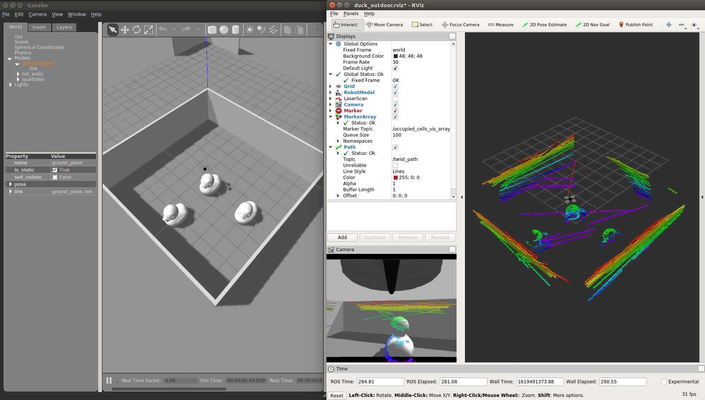

# Autonomous 3D Reconstruction with UAVs in ROS using Frontier Exploration with added Randomness



Unmanned Aerial Vehicles (UAVs) are widely used for documenting and monitoring topography. Moreover, conventional transmission-based remote controller are range-limiting and it becomes a challenge to explore large, unknown, and unstructured environments with them. Numerous studies have been carried out to automate the exploration task and one of the most common approaches is to use Frontier Exploration. However, it is subject to the local minima problem and in the field of robotics, this is often mitigated by introducing stochasticity to the system. Therefore, in this project, our objective is to investigate the impact of randomness on frontier guided exploration algorithms, and compared it with respect to the random walk (baseline) and non-autonomous approach. We have achieved 11.13% percentage increase in mesh coverage comparing to the baseline using Frontier Exploration with Randomness in a single target environment. We also concluded that stochasticity is useful for a less congested environment, whereas more complicated structures would require more guidance during exploration. Finally, we hope that our work could provide insights on developing solutions and frameworks for navigation challenge with exploration objective. For details of the research, please refer to `MRS_Mini_Project.pdf`.

### Demo
Demo video available - frontier_exploration_demo.mp4

### Run Scheme - Predefined Path
Run the following commands in separate terminal windows. 
```
roslaunch duck_demo duck_flight_gazebo.launch
rosservice call enable_motors true
roslaunch hector_exploration_node exploration_planner.launch 
roslaunch octomap_server octomap_mapping.launch
roslaunch duck_controller action_openloop.launch
```

### Run Scheme - Random Walk
Run the following commands in separate terminal windows. 
```
roslaunch duck_demo duck_flight_gazebo.launch
rosservice call enable_motors true
roslaunch hector_exploration_node exploration_planner.launch 
roslaunch octomap_server octomap_mapping.launch
roslaunch duck_controller action_astar.launch
```

### Run Scheme - Frontier Exploration
Run the following commands in separate terminal windows. 
```
roslaunch duck_demo duck_flight_gazebo.launch
rosservice call enable_motors true
roslaunch hector_exploration_node exploration_planner.launch 
roslaunch octomap_server octomap_mapping.launch
roslaunch duck_controller action_frontier.launch
```

### Code Files
Code files are located at `code/src/duck/`


### Other Remarks
https://gist.github.com/elimkwan/f5e3c09187ee5dbe48e5740af9064707
